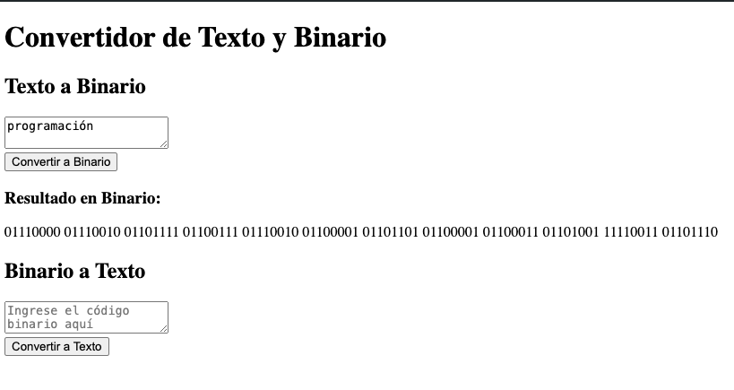

# Convertir de binario a texto y viceversa 


crear entorno virtual:
```bash
python -m venv venv
```
activar entorno virtual:
en mac:
```bash
source venv/bin/activate
```
en windows:
```bash
venv/Scripts/activate
```
instalar flask:
```bash
pip install flask
```
correr el programa:
```bash
python app.py
```
img demo version 1:

